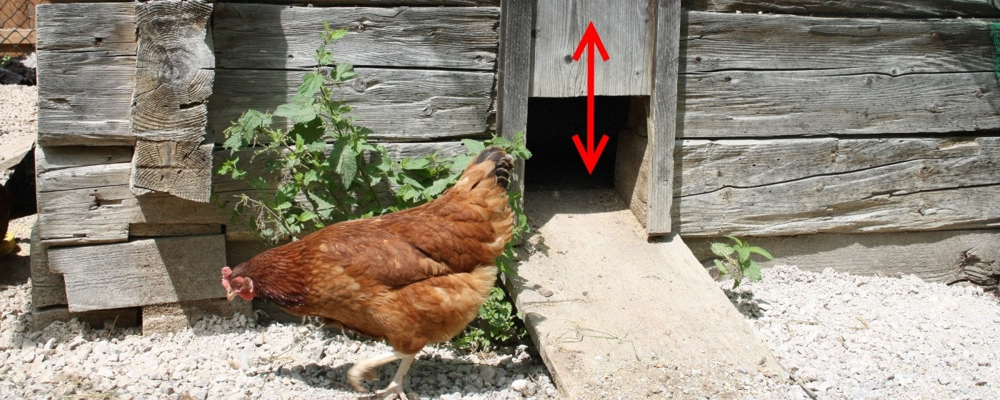

# `closeable-map`

[](https://clojars.org/piotr-yuxuan/closeable-map)
[](https://cljdoc.org/d/piotr-yuxuan/closeable-map/CURRENT)
[](https://github.com/piotr-yuxuan/closeable-map/blob/main/LICENSE)
[](https://github.com/piotr-yuxuan/closeable-map/issues)

`<scherz>`Think about Zelda: when hens are free to propagate
everywhere, they attack you and it becomes a mess. Your application
state is like your hens: it's safe when it is securely contained in a
coop with automated doors to prevent run-aways.`</scherz>`



This small Clojure library tries to get as close as possible to the
bare essential complexity of state management in code. It defines a
new type of Clojure map that you may `(.close m)`. `<scherz>`See it in
action above`</scherz>`.

This library defines a new type of map that you may use like any other
map. This map may contain stateful Java objects like a server, a Kafka
producer, a file output stream. When you want to clean your state, you
just `.close` the map and all nested stateful objects will be closed
recursively.

It is a tiny alternative to more capable projects:

- Application state management:
  [stuartsierra/component](https://github.com/stuartsierra/component),
  [weavejester/integrant](weavejester/integrant),
  [tolitius/mount](https://github.com/tolitius/mount), _et al_.
- Extension of `with-open`:
  [jarohen/with-open](https://github.com/jarohen/with-open)
- Representing state in a map:
  [robertluo/fun-map](https://github.com/robertluo/fun-map)

## Usage

In your project, require:

``` clojure
(require '[piotr-yuxuan.closeable-map :as closeable-map :refer [close-with with-tag]])
```

Define an application that can be started, and closed.

``` clojure
(defn start
  "Return a map describing a running application, and which values may
  be closed."
  [config]
  (closeable-map/closeable-map
    {;; Kafka producers/consumers are `java.io.Closeable`.
     :producer (kafka-producer config)
     :consumer (kafka-consumer config)}))
```

You can start/stop the app in the repl with:

``` clojure
(comment
  (def config (load-config))
  (def system (start config))

  ;; Stop/close all processes/resources with:
  (.close system)
  )
```

It can be used in conjunction with `with-open` in test file to create
well-contained, independent tests:

``` clojure
(with-open [{:keys [consumer] :as app} (start config)]
  (testing "unit test with isolated, repeatable context"
    (is (= :yay/🚀 (some-business/function consumer)))))
```

You could also use thi library while live-coding to stop and restart
your application whenever a file is changed.

## More details

``` clojure
(defn start
  "Return a map describing a running application, and which values may
  be closed."
  [config]
  (closeable-map/closeable-map
    {;; Kafka producers/consumers are `java.io.Closeable`.
     :producer (kafka-producer config)
     :consumer (kafka-consumer config)

     ;; File streams are `java.io.Closeable` too:
     :logfile (io/output-stream (io/file "/tmp/log.txt"))

     ;; Closeable maps can be nested. Nested maps will be closed before the outer map. 
     :backend/api {:response-executor (close-with (memfn ^ExecutorService .shutdown)
                                        (flow/utilization-executor (:executor config)))
                   :connection-pool (close-with (memfn ^IPool .shutdown)
                                      (http/connection-pool {:pool-opts config}))

                   ;; These functions receive their map as argument.
                   ::closeable-map/before-close (fn [m] (backend/give-up-leadership config m))
                   ::closeable-map/after-close (fn [m] (backend/close-connection config m))}

     ;; Any exception when closing this nested map will be swallowed
     ;; and not bubbled up.
     :db ^::closeable-map/swallow {;; Connection are `java.io.Closeable`, too:
                                   :db-conn (jdbc/get-connection (:db config))}

     ;; Some libs return a zero-argument function which when called
     ;; stops the server, like:
     :server (with-tag ::closeable-map/fn (http/start-server (api config) (:server config)))
     ;; Gotcha: Clojure meta data can only be attached on 'concrete'
     ;; objects; they are lost on literal forms (see above).
     :forensic ^::closeable-map/fn #(metrics/report-death!)

     ::closeable-map/ex-handler
     (fn [ex]
       ;; Will be called for all exceptions thrown when closing this
       ;; map and nested items.
       (println (ex-message ex)))}))
```

When `(.close system)` is executed, it will:

  - Recursively close all instances of `java.io.Closeable` and
    `java.lang.AutoCloseable`;
  - Recursively call all stop zero-argument functions tagged with
    `^::closeable-map/fn`;
  - Skip all nested `Closeable` under a `^::closeable-map/ignore`;
  - Silently swallow any exception with `^::closeable-map/swallow`;
  - Exceptions to optional `::closeable-map/ex-handler` in key or
    metadata;
  - If keys (or metadata) `::closeable-map/before-close` or
    `::closeable-map/after-close` are present, they will be assumed as
    a function which takes one argument (the map itself) and used run
    additional closing logic:

    ``` clojure
    (closeable-map
      {;; This function will be executed before the auto close.
       ::closeable-map/before-close (fn [this-map] (flush!))

       ;; Kafka producers/consumers are java.io.Closeable
       :producer (kafka-producer config)
       :consumer (kafka-consumer config)

       ;; This function will be executed after the auto close.
       ::closeable-map/after-close (fn [this-map] (garbage/collect!))})
    ```

Some classes do not implement `java.lang.AutoCloseable` but present
some similar method. For example instances of
`java.util.concurrent.ExecutorService` can't be closed but they can be
`.shutdown`:

``` clojure
{:response-executor (close-with (memfn ^ExecutorService .shutdown)
                      (flow/utilization-executor (:executor config)))
 :connection-pool (close-with (memfn ^IPool .shutdown)
                    (http/connection-pool {:pool-opts config}))}
```

You may also extend this library by giving new dispatch values to
multimethod [[piotr-yuxuan.closeable-map/close!]]. Once evaluated,
this will work accross all your code. The multimethod is dispatched on
the concrete class of its argument:

``` clojure
(import '(java.util.concurrent ExecutorService))
(defmethod closeable-map/close! ExecutorService
  [x]
  (.shutdown ^ExecutorService x))

(import '(io.aleph.dirigiste IPool))
(defmethod closeable-map/close! IPool
  [x]
  (.shutdown ^IPool x))
```

## All or nothing

### No half-broken closeable map

You may also avoid partially open state when an exception is thrown
when creating a `CloseableMap`. This is where `closeable-map*` comes
handy. It outcome in one of the following:

- Either everything went right, and all inner forms wrapped by
  `closeable` correctly return a value; you get an open instance of `CloseableMap`.

- Either some inner form wrapped by `closeable` didn't return a
  closeable object but threw an exception instead. Then all
  `closeable` forms are closed, and finally the exception is
  bubbled up.

``` clojure
(closeable-map*
  {:server (closeable* (http/start-server (api config)))
   :kafka {:consumer (closeable* (kafka-consumer config))
           :producer (closeable* (kafka-producer config))
           :schema.registry.url "https://localhost"}})
```

### No half-broken state in general code

In some circumstances you may need to handle exception on the creation
of a closeable map. If an exception happens during the creation of the
map, values already evaluated will be closed. No closeable objects
will be left open with no references to them.

For instance, this form would throw an exception:

``` clojure
(closeable-map/closeable-map {:server (http/start-server (api config))
                              :kafka {:consumer (kafka-consumer config)
                                      :producer (throw (ex-info "Exception" {}))}})
;; => (ex-info "Exception" {})
```

`with-closeable*` prevents that kind of broken, partially open states for its bindings:

``` clojure
(with-closeable* [server (http/start-server (api config))
                  consumer (kafka-consumer config)
                  producer (throw (ex-info "Exception" {}))]
  ;; Your code goes here.
)
;; Close consumer,
;; close server,
;; finally throw `(ex-info "Exception" {})`.
```

You now have the guarantee that your code will only be executed if
all these closeable are open. In the latter example an exception is
thrown when `producer` is evaluated, so `consumer` is closed, then
`server` is closed, and finally the exception is bubbled up. Your
code is not evaluated. In the next example the body is evaluated,
but throws an exception: all bindings are closed.

``` clojure
(with-closeable* [server (http/start-server (api config))
                  consumer (kafka-consumer config)
                  producer (kafka-producer config)]
  ;; Your code goes here.
  (throw (ex-info "Exception" {})))
;; Close producer,
;; close consumer,
;; close server,
;; finally throw `(ex-info "Exception" {})`.
```

When no exception is thrown, leave bindings open and return like a
normal `let` form. If you prefer to close bindings, use `with-open` as
usual.
  
``` clojure
(with-closeable* [server (http/start-server (api config))
                  consumer (kafka-consumer config)
                  producer (kafka-producer config)]
  ;; Your code goes here.
  )
;; All closeable in bindings stay open.
;; => result
```

## Technicalities

Some Clojure datastructures implement `IFn`:

``` clojure
({:a 1} :a) ;; => 1
(remove #{:a} [:a :b :c]) ;; => '(:b :c)
([:a :b :c] 1) ;; => :b
```

Clojure maps (`IPersistentMap`) implement `IFn`, for `invoke()` of one
argument (a key) with an optional second argument (a default value),
i.e. maps are functions of their keys. `nil` keys and values are fine.

This library defines a new data strucure, CloseableMap. It is exposed
as an instance of `java.io.Closeable` which is a subinterface of
`java.lang.AutoCloseable`. When trying to close its values, it looks
for instances of the latter. As such, it tries to be most general.

``` clojure
(require '[clojure.data])

(clojure.data/diff
  (ancestors (class {}))
  (ancestors CloseableMap))

;; =>
[;; Ancestors of Clojure map only but not CloseableMap.
 #{clojure.lang.AFn ; Concrete type, but see below for IFn.
   clojure.lang.APersistentMap
   clojure.lang.IEditableCollection
   clojure.lang.IKVReduce
   clojure.lang.IMapIterable
   java.io.Serializable}

 ;; Ancestors of CloseableMap only.
 #{clojure.lang.IType
   java.io.Closeable
   java.lang.AutoCloseable
   java.util.Iterator
   potemkin.collections.PotemkinMap
   potemkin.types.PotemkinType}

 ;; Ancestors common to both types.
 #{clojure.lang.Associative
   clojure.lang.Counted
   clojure.lang.IFn
   clojure.lang.IHashEq
   clojure.lang.ILookup
   clojure.lang.IMeta
   clojure.lang.IObj
   clojure.lang.IPersistentCollection
   clojure.lang.IPersistentMap
   clojure.lang.MapEquivalence
   clojure.lang.Seqable
   java.lang.Iterable
   java.lang.Object
   java.lang.Runnable
   java.util.Map
   java.util.concurrent.Callable}]
```
